# AI 智能医疗问诊平台 Frontend

一个基于 Vue 3 + Vite + TypeScript 的前端应用，面向 AI 智能医疗问诊场景，提供患者问诊、病历查看、数据统计、知识库展示等功能模块，支持与后端 API 对接，适用于医疗信息管理与智能问诊系统的前端交互。

## 项目概览

本项目采用前后端分离架构，前端负责：

- 用户登录与权限管理
- 智能问诊交互
- 医疗数据展示
- 诊疗记录管理
- 统计分析与报表展示
- 通用管理后台页面

## 功能特点

- Vue 3 + Vite + TypeScript 开发
- Element Plus 组件库支持
- Pinia 状态管理
- Axios 统一接口请求封装
- ECharts 数据可视化
- Markdown 渲染支持
- 多环境配置（dev / test / prod）
- 路由权限与页面布局统一管理

## 技术栈

- Vue 3
- Vite
- TypeScript
- Pinia
- Vue Router
- Element Plus
- Axios
- ECharts
- Sass / CSS
- ESLint / Prettier

## 项目结构

```bash
frontend/
├─ public/                  # 静态资源
├─ src/
│  ├─ api/                  # 接口请求
│  ├─ assets/               # 图片、图标、样式资源
│  ├─ components/           # 公共组件
│  ├─ hooks/                # 自定义 Hook
│  ├─ layout/              # 布局组件
│  ├─ router/               # 路由配置
│  ├─ store/                # Pinia 状态管理
│  ├─ styles/               # 全局样式
│  ├─ typings/                # TypeScript 类型定义
│  ├─ utils/                # 工具函数
│  ├─ views/                # 页面视图
│  ├─ App.vue
│  └─ main.ts
├─ .env                     # 默认环境变量
├─ .env.dev                 # 开发环境变量
├─ .env.prod                # 生产环境变量
├─ index.html
├─ package.json
├─ vite.config.ts
├─ tsconfig.json
├─ README.md
└─ pnpm-lock.yaml
```

## 环境要求

- Node.js >= 20
- pnpm
- 推荐使用 VS Code + Volar 插件

## 安装依赖

```bash
pnpm install
```

## 启动开发环境

```bash
pnpm dev
```

默认会启动 Vite 开发服务器，可在浏览器中访问本地地址进行开发。

## 构建项目

开发环境构建：

```bash
pnpm build:dev
```

测试环境构建：

```bash
pnpm build:test
```

生产环境构建：

```bash
pnpm build:pro
```

## 代码检查

```bash
pnpm type:check
pnpm lint:eslint
```

## 环境变量说明

项目中使用了环境变量文件，例如：

- `.env`
- `.env.dev`
- `.env.prod`

可用于配置：

- API 地址
- 运行环境
- 图片资源地址
- 其他前端公共配置

示例：

```env
VITE_API_BASE_URL=http://localhost:8000
VITE_APP_TITLE=AI医疗问诊平台
```

## 常用脚本

```bash
pnpm dev         # 启动开发环境
pnpm serve       # 启动 Vite 本地服务
pnpm build:dev   # 构建开发环境
pnpm build:test  # 构建测试环境
pnpm build:pro   # 构建生产环境
pnpm type:check  # TypeScript 类型检查
pnpm lint:eslint # ESLint 代码检查
```

## 说明

该前端工程适合用于医疗问诊平台、患者端/管理端的 UI 开发，也可作为后端 API 接口联调和前端业务开发的基础模板。

## 项目运行截图（部分）

#### 登录界面


#### 用户端

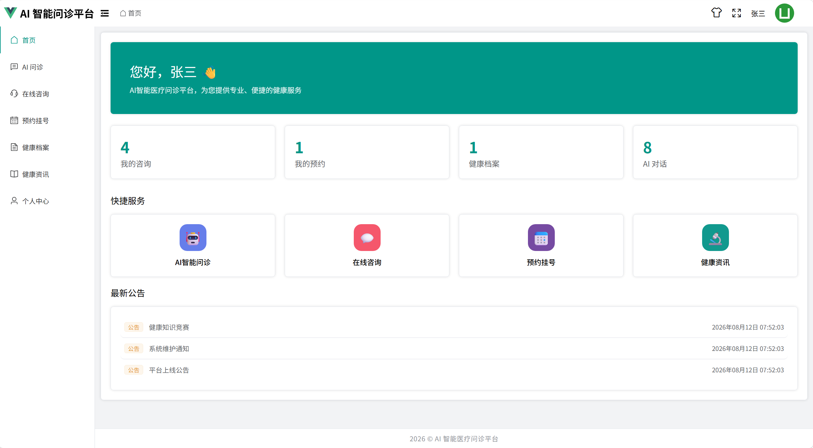

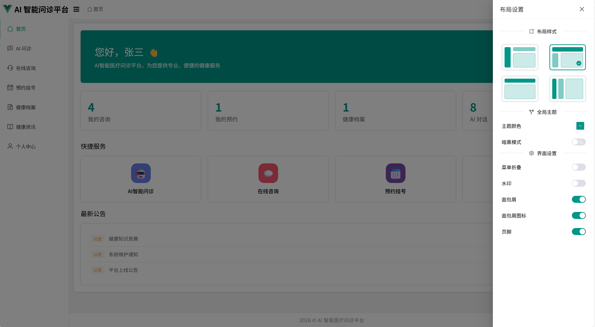

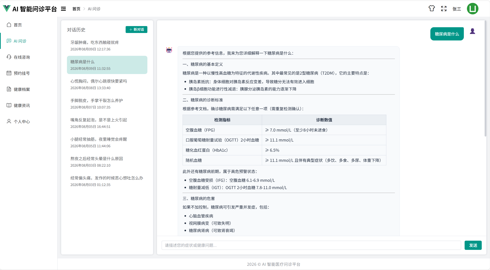

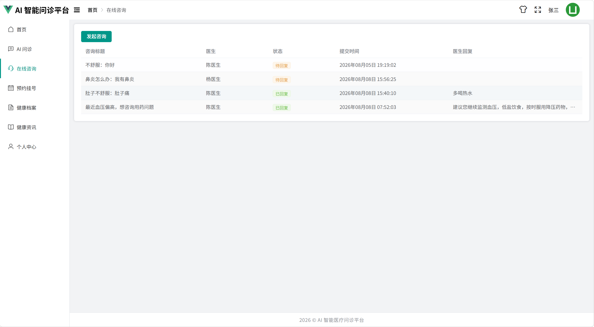

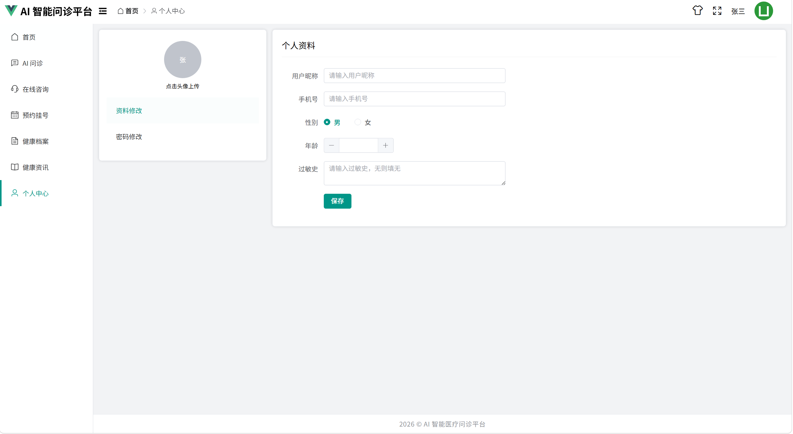

管理端
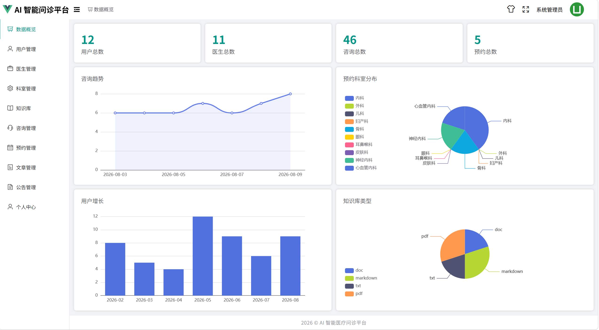

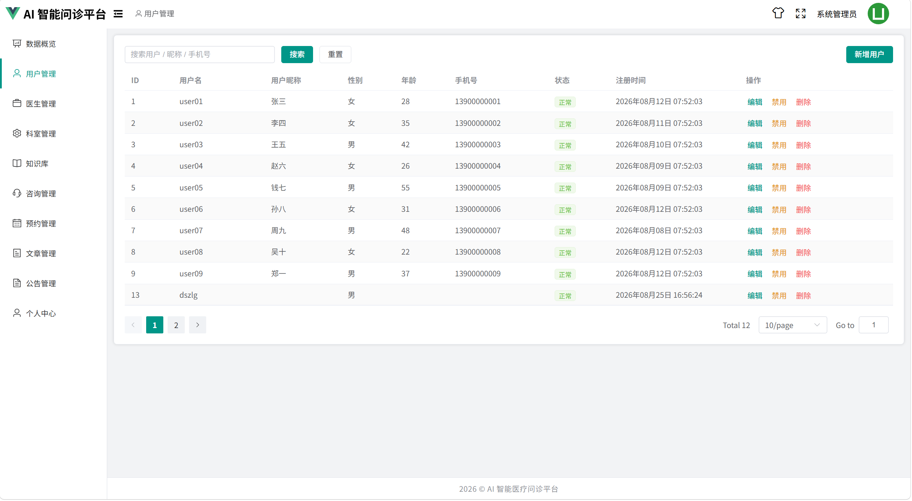

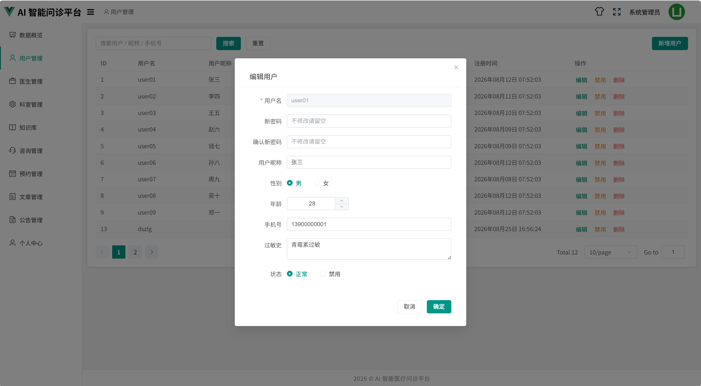

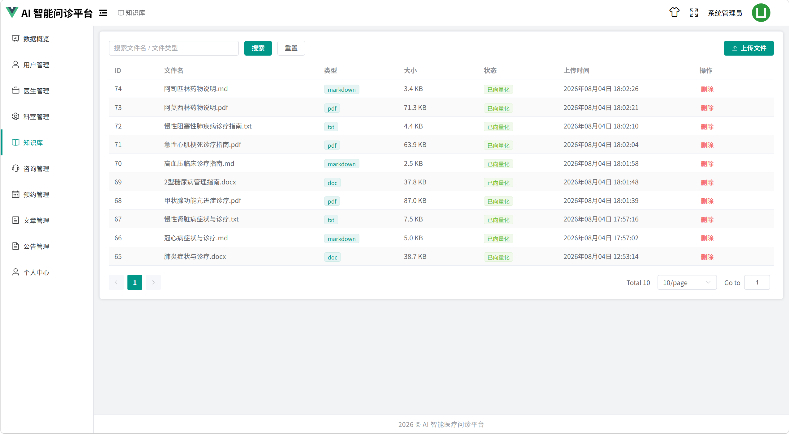

#### 医生端

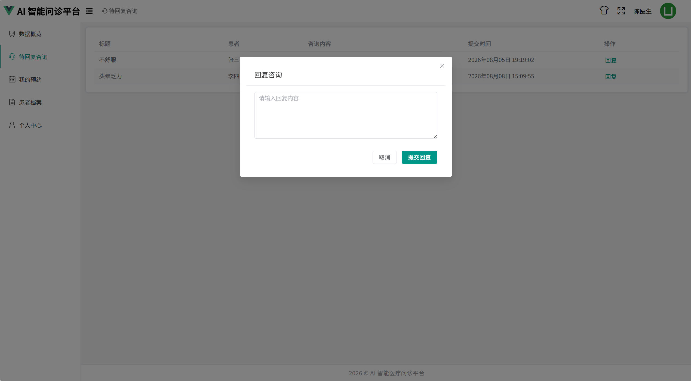

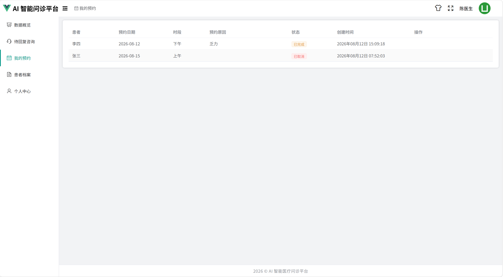
